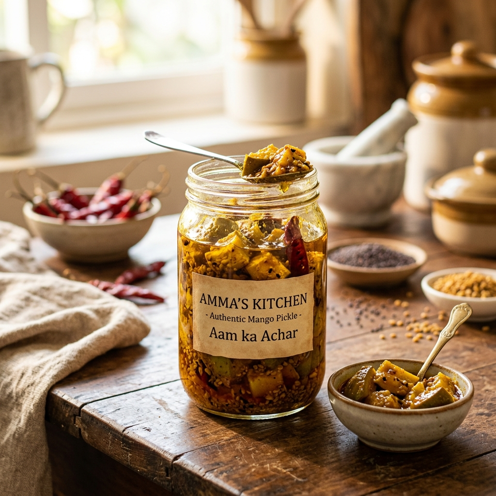
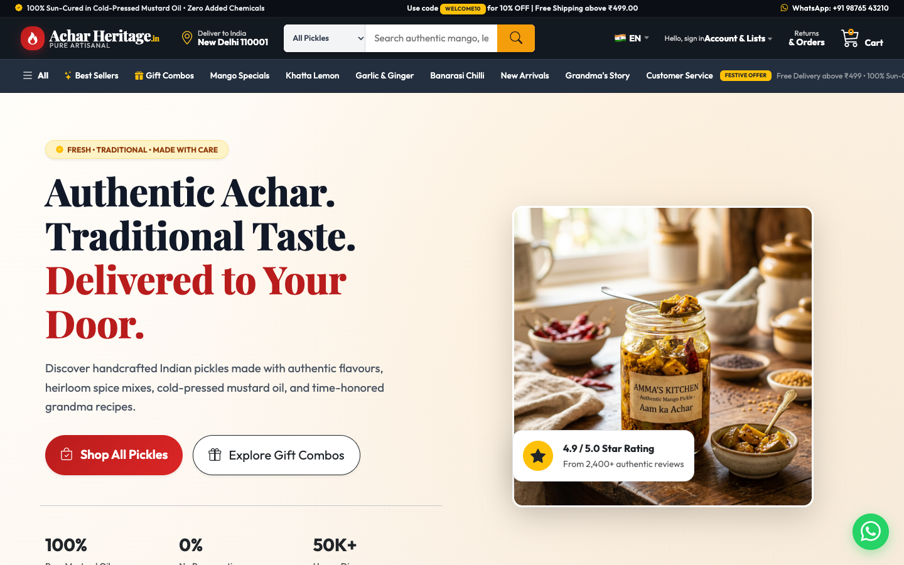
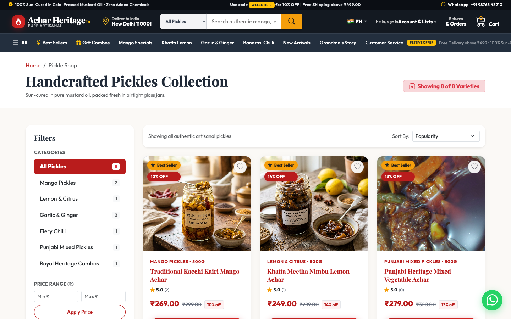
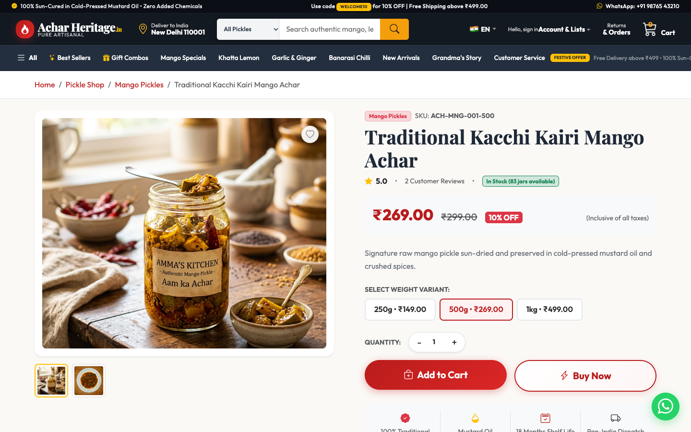
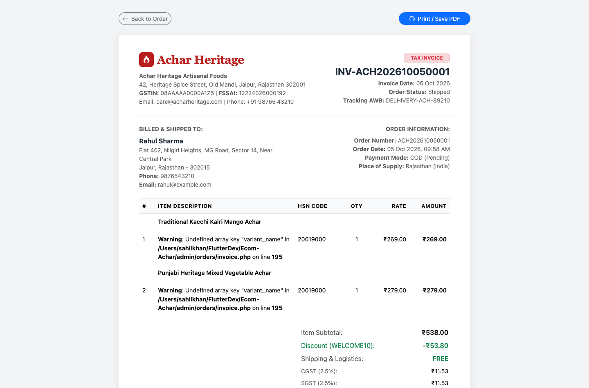
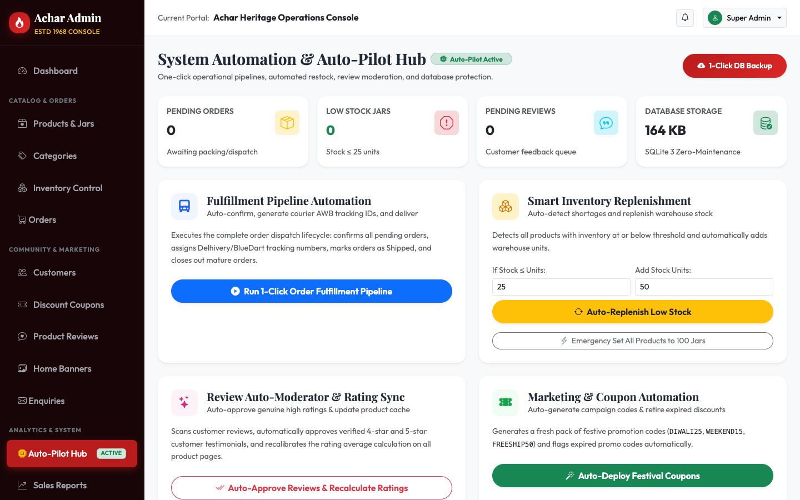
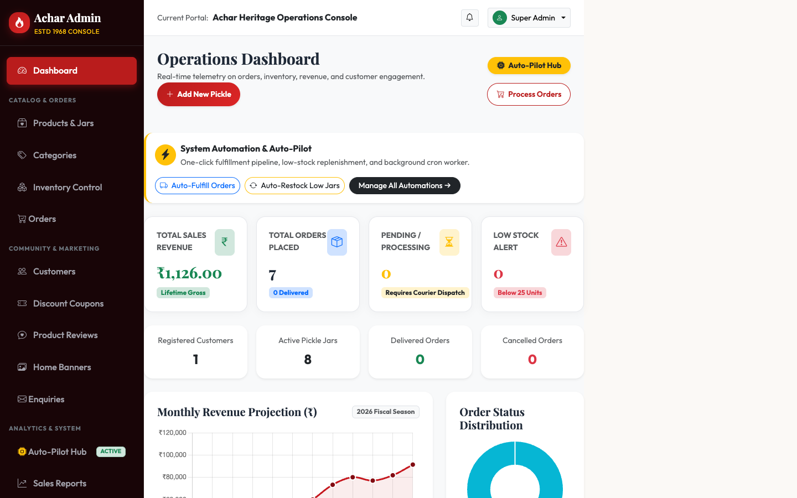
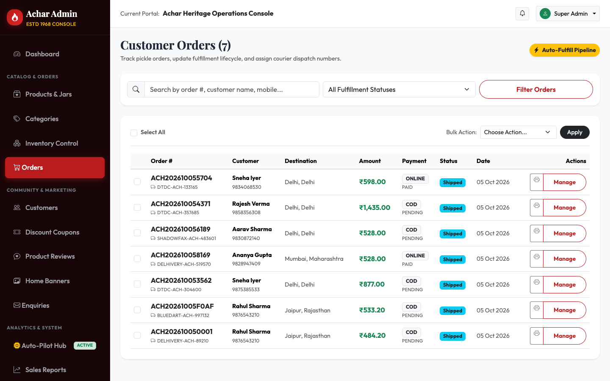

# 🌶️ Achar Heritage – Authentic Handcrafted Pickle E-Commerce & Automated Admin Operations

<p align="center">
  
</p>

<p align="center">
  <strong>Production-Ready Artisanal Indian Pickle (Achar) D2C Storefront + Complete Autonomous Admin Operations Console</strong>
</p>

<p align="center">
  
  
  
  
  
  
</p>

---

## 📸 Visual Showcase & Screen Tours

### 🛍️ 1. Customer Storefront (Amazon-Style Navigation & Gourmet Culinary UI)
The storefront features an **Amazon-inspired navigation bar**, live pincode delivery estimator, mega department search, category pills, and an elegant warm linen hero section showcasing real handcrafted pickles.

| 🏠 Homepage & Amazon-Style Header | 🛒 Shop Catalog with Filter Sidebar |
|:---:|:---:|
|  |  |
| *Amazon Deep Slate Header (`#131921`), Category Search, & Warm Gourmet Hero* | *Multi-attribute filters (Categories, Price, Bestsellers) & Real Photography* |

| 🔍 Product Detail & Interactive Gallery | 🧾 Official Printable GST Tax Invoice |
|:---:|:---:|
|  |  |
| *Real photo zoom thumbnails, multi-weight variants (250g/500g/1kg), and reviews* | *Official GST-compliant invoice with HSN codes, tax splits, & 1-click print* |

---

### 🛡️ 2. Administrative Operations Console & Auto-Pilot Hub
A powerhouse back-office control center enabling administrators to monitor telemetry, process dispatches, replenish low inventory, and run automated cron maintenance.

| ⚡ Master Automation & Auto-Pilot Hub | 📊 Real-Time Operations KPI Dashboard |
|:---:|:---:|
|  |  |
| *1-Click fulfillment pipeline, low-stock replenishment, & DB backup* | *Live gross revenue, order volume, Chart.js telemetry, & quick-actions bar* |

| 📦 Order Fulfillment with Bulk Actions |
|:---:|
|  |
| *Bulk status updater (`Mark Shipped`, `Auto AWB`), courier dispatch tracking, & instant invoice generation* |

---

## 🌟 Key Features Breakdown

### 🛒 Customer-Facing Storefront
* **Authentic Amazon-Style Header & Navigation**:
  * Sleek dark charcoal header (`#131921`) with high contrast and zero eye-strain.
  * **Deliver to Pincode Widget**: Live pincode prompt with modal location switcher.
  * **Mega Department Search**: Dropdown category department selector + AJAX auto-suggest.
  * **Signature Flyouts**: Account & Lists 2-column menu, Returns & Orders, and shopping basket counter.
  * **Amazon Subnav Strip (`#232F3E`)**: `☰ All` hamburger drawer, category shortcuts, and festive offers.
* **Warm Gourmet Heritage Palette**:
  * Sophisticated warm linen background (`linear-gradient(135deg, #FFFDF9 0%, #FDF7F0 45%, #F6ECE0 100%)`).
  * Real authentic high-resolution pickle photography (Mango, Lemon, Garlic, Banarasi Chilli, Mixed Vegetable, Ginger, Hing, and Shahi Combos).
* **Product Details & Packaging Varieties**:
  * Multi-weight variant selector (250g, 500g, 1kg) with dynamic real-time price & stock recalculation.
  * Clickable interactive thumbnail galleries with high-res photography.
  * Verified buyer reviews submission with live rating updates.
* **Smart Shopping Cart & Checkout**:
  * Dynamic Free Shipping progress tracker (threshold ₹499).
  * Coupon voucher discount engine (`WELCOME10`, `DIWALI25`, `WEEKEND15`, `FREESHIP50`).
  * 4-step streamlined checkout supporting Cash on Delivery (COD) and Online Payment.
  * Visual 5-stage order tracking timeline (`Placed -> Confirmed -> Packed -> Shipped -> Delivered`).

---

### 🛡️ Automated Administrative Operations (`/admin`)
* **⚡ Master Automation & Auto-Pilot Hub (`admin/automation.php`)**:
  * **1-Click Fulfillment Pipeline**: Automatically confirms pending orders, packs items, generates realistic courier tracking numbers (Delhivery, BlueDart, DTDC, Shadowfax), and marks in-transit orders as delivered.
  * **Smart Inventory Replenishment**: Automatically scans warehouse stock for items below threshold (&le; 25 units) and adds fresh inventory with a single click.
  * **Review Auto-Moderator**: Automatically evaluates customer reviews, approves genuine 4+ star ratings, and synchronizes product rating caches across the catalog.
  * **Marketing Coupon Factory**: Deploys fresh holiday promo codes and automatically deactivates expired vouchers.
  * **Simulated Order Generator**: Generates 1, 3, or 5 realistic test customer orders with authentic Indian addresses and items for testing logistics.
  * **1-Click Database Backup**: Downloads timestamped SQLite/MySQL database backup files directly to the browser.
* **⏱️ Unattended Background Cron Worker (`admin/cron.php`)**:
  * Supports CLI execution via system crontab (`* * * * * php admin/cron.php`).
  * Supports secure external webhook execution via HTTP GET with secret token authentication (`/admin/cron.php?key=...`).
* **🧾 Official GST Tax Invoice Generator (`admin/orders/invoice.php`)**:
  * Fully formatted printable GST tax invoice.
  * Company details, GSTIN, FSSAI License, Bill-to/Ship-to, itemized table with HSN codes (`20019000`), CGST (2.5%) + SGST (2.5%) breakdown, and authorized signatory.
* **📦 Orders Management with Bulk Operations (`admin/orders/index.php`)**:
  * Checkbox multi-select with bulk actions (`Mark Confirmed`, `Mark Shipped with Auto AWB`, `Mark Delivered`, `Cancel`).
* **📊 Analytics & KPI Dashboard (`admin/dashboard.php`)**:
  * Live revenue counters, active orders breakdown, low-stock warnings, and Chart.js graphical visualizations.
* **🏷️ Full Product & Category CRUD**:
  * Multi-weight packaging builder, stock control, category display order, and image upload handlers.

---

## 💻 Technology Architecture

```text
Ecom-Achar/
├── 📁 admin/                      # Operations & Management Console
│   ├── 📁 banners/                # Promotional hero banners manager
│   ├── 📁 categories/             # Category CRUD & ordering
│   ├── 📁 contact/                # Customer inquiries & ticketing
│   ├── 📁 coupons/                # Discount coupon voucher manager
│   ├── 📁 customers/              # Customer directory & access toggles
│   ├── 📁 includes/               # Admin sidebar, header, footer
│   ├── 📁 orders/                 # Order fulfillment, bulk actions & invoices
│   │   ├── index.php              # Orders list with bulk actions
│   │   ├── view.php               # Order inspector & lifecycle controller
│   │   └── invoice.php            # Official printable GST Tax Invoice template
│   ├── 📁 products/               # Product CRUD & inventory manager
│   │   ├── index.php              # Products list with search & filters
│   │   ├── add.php                # Add product with multi-weight variant builder
│   │   ├── edit.php               # Edit product & variants
│   │   ├── delete.php             # Delete product
│   │   └── inventory.php          # Quick stock replenishment
│   ├── 📁 reports/                # Sales reports with CSV spreadsheet export
│   ├── automation.php             # System Auto-Pilot Hub (1-click fulfill, restock, backup)
│   ├── cron.php                   # Unattended background cron worker (CLI & Webhook)
│   ├── dashboard.php              # Operations dashboard with Auto-Pilot Command Bar
│   ├── login.php                  # Secure admin login portal
│   ├── logout.php                 # Admin logout
│   └── settings.php               # Store settings, delivery fees & payment keys
├── 📁 ajax/                       # Dynamic AJAX endpoints (cart, search, wishlist)
├── 📁 assets/                     # Stylesheets, JavaScript modules, fonts
│   ├── 📁 css/
│   │   └── style.css              # Custom responsive stylesheet & Amazon theme tokens
│   └── 📁 js/
│       └── app.js                 # Cart operations, pincode modal, live search
├── 📁 config/                     # Configuration & Database connection
│   ├── config.php                 # App constants, URLs, shipping thresholds
│   └── database.php               # PDO MySQL connection with automated SQLite fallback
├── 📁 database/                   # Database schemas & storage
│   ├── achar_store.sqlite         # SQLite database file (active local fallback)
│   └── sqlite_schema.sql          # Standalone SQLite schema & seed records
├── 📁 docs/
│   └── 📁 screenshots/            # High-resolution documentation screenshots
├── 📁 includes/                   # Storefront UI layout components
│   ├── footer.php                 # Amazon-style 4-column directory & back-to-top footer
│   ├── functions.php              # Global helper functions, auth, & sanitization
│   ├── header.php                 # HTML head & dynamic CSS cache-busting
│   ├── navbar.php                 # Amazon-style header, search, & offcanvas drawer
│   └── product_card.php           # Reusable product card component
├── 📁 uploads/                    # User & catalog upload storage
│   ├── 📁 banners/                # High-res wide promotional banners
│   ├── 📁 categories/             # Category thumbnails
│   └── 📁 products/               # Real authentic pickle product photography
├── database.sql                   # MySQL 8+ complete database schema & seed data
├── index.php                      # Homepage with Amazon header & linen hero
├── shop.php                       # Product catalog with filter sidebar
├── product.php                    # Product details page with gallery thumbnails
├── cart.php                       # Shopping basket & coupon code redemption
├── checkout.php                   # Multi-step checkout & address selector
├── order-success.php              # Order confirmation with visual 5-stage stepper
├── order-tracking.php             # Public order tracking by order # and mobile
├── account.php                    # Customer profile, addresses, & order history
├── wishlist.php                   # Customer wishlist
├── Makefile                       # One-command build & launch scripts
└── README.md                      # Comprehensive documentation
```

---

## 🚀 Quick Start Guide

### Option 1: One-Click Local Server (Recommended)
The project includes a built-in automated SQLite fallback database seeded with 8 products, 6 categories, reviews, and test orders.

1. Open your terminal in the project directory:
   ```bash
   cd /Users/sahilkhan/FlutterDev/Ecom-Achar
   ```

2. Start the local PHP development server:
   ```bash
   php -S 127.0.0.1:8000
   ```
   *(Or simply run `make run`)*

3. Open your browser and navigate to:
   - **Customer Storefront**: [http://127.0.0.1:8000](http://127.0.0.1:8000)
   - **Admin Operations Console**: [http://127.0.0.1:8000/admin/login.php](http://127.0.0.1:8000/admin/login.php)
   - **Auto-Pilot Operations Hub**: [http://127.0.0.1:8000/admin/automation.php](http://127.0.0.1:8000/admin/automation.php)

---

### Option 2: MySQL / XAMPP / Production Setup
1. Start Apache & MySQL in **XAMPP / MAMP** or your VPS.
2. Create a new database named `achar_db`:
   ```sql
   CREATE DATABASE achar_db CHARACTER SET utf8mb4 COLLATE utf8mb4_unicode_ci;
   ```
3. Import the database schema and sample records:
   ```bash
   mysql -u root -p achar_db < database.sql
   ```
4. Adjust credentials in [`config/database.php`](config/database.php) or export environment variables:
   ```bash
   export DB_HOST=127.0.0.1
   export DB_NAME=achar_db
   export DB_USER=root
   export DB_PASS=your_password
   ```

---

## 🔑 Default Login Credentials

| Role | Portal URL | Email | Password |
| :--- | :--- | :--- | :--- |
| **Super Admin** | [`/admin/login.php`](http://127.0.0.1:8000/admin/login.php) | `admin@achar.com` | `Admin@123` |
| **Demo Customer** | [`/auth/login.php`](http://127.0.0.1:8000/auth/login.php) | `rahul@example.com` | `Customer@123` |

*(Tip: Both login pages feature an **"Auto-fill Credentials"** button for immediate testing without manual typing)*

---

## ⚡ Automated Operations & Cron Scheduling

### Unattended Server Crontab
To automate order status transitions, low stock tracking, review moderation, and coupon retirement automatically without logging in:

```bash
# Run every minute via server crontab
* * * * * php /Users/sahilkhan/FlutterDev/Ecom-Achar/admin/cron.php > /dev/null 2>&1
```

### External Webhook Ping
If using cloud schedulers (like Google Cloud Scheduler, Cron-Job.org, or UptimeRobot), trigger the webhook endpoint with the secret key:

```http
GET http://yourdomain.com/admin/cron.php?key=achar_secret_cron_token_1968
```

---

## 🛡️ Security Best Practices
- **SQL Injection Prevention**: All queries use PDO with parameterized prepared statements.
- **Cross-Site Scripting (XSS)**: All customer outputs are escaped using `e()` (`htmlspecialchars` with UTF-8).
- **Cross-Site Request Forgery (CSRF)**: State-changing POST forms enforce cryptographic `csrf_token()` validation.
- **Secure Password Hashing**: Passwords stored via PHP `password_hash()` utilizing BCrypt.
- **Upload Validation**: File uploads enforce strict MIME-type inspection (`finfo`), extension whitelisting, and size caps.

---

## 📄 License
This project is licensed under the **MIT License** – free for personal, commercial, and educational use.

Made with care for authentic Indian traditional flavours. 🌶️
